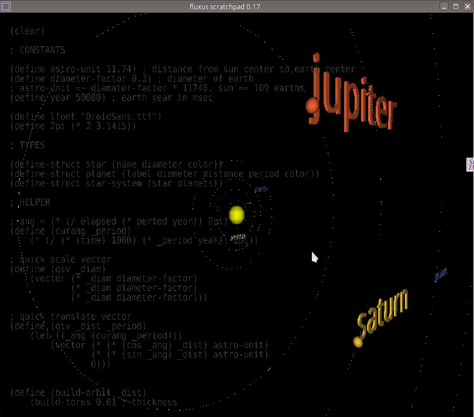
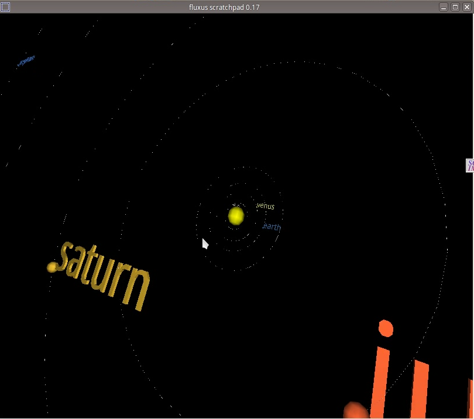

Я [уже писал](Blog/blog-en/2010-07-10-post-about-fluxus) про [fluxus](http://www.pawfal.org/fluxus/), систему livecoding и, по совместительству, 3D-прототипирования. Теперь хочу показать его возможности и как им можно пользоваться в целях, близких к псевдонаучным. Например, можно смоделировать и уместить упрощённую солнечную систему всего в 125 строк (это достоинство языка [Racket](http://racket-lang.org/) с графическими стероидами, развития PLT Scheme, который лежит в основе fluxus). Вот как будет выглядеть результат:

В посте исходники, краткое описание на русском и livecoding-видеоролики на славянском английском в подробностях рассматривающие и следящие за всем процессом написания этого сложного кода.

### Исходники

[ВОТ](http://paste.pocoo.org/show/301220/)

> Заметка: Они были потеряны вместе с Poocoo, так что я попробую восстановить их из видео

### Описание

Fluxus использует понятие машины состояний для построения сцены. Если вы использовали в программировании OpenGL, вам знаком этот принцип - каждая последующая функция в коде либо изменяет матрицу состояния сцены, либо меняет само состояние сцены (например, отображает объект). Объекты для сцены можно построить предварительно до какого-либо рендеринга, а потом изменять их состояния или же рисовать новые примитивы в каждом кадре (OpenGL понимает, что неизмненяемые объекты можно кэшировать между кадрами). Я объединяю оба этих пути, подготавливая шрифтовые надписи и орбиты планет до рендеринга и рисуя планеты в каждом новом фрейме.

Все данные об диаметрах, орбитальных радиусах и периодах обращения планет я банально брал из одной-единственной таблицы в [статье из википедии](http://ru.wikipedia.org/wiki/%D0%9F%D0%BB%D0%B0%D0%BD%D0%B5%D1%82%D0%B0#.D0.A1.D0.BE.D0.BB.D0.BD.D0.B5.D1.87.D0.BD.D0.B0.D1.8F_.D1.81.D0.B8.D1.81.D1.82.D0.B5.D0.BC.D0.B0). Что удобно, все нужные данные указаны в ней относительно Земли (так устроена астрономическая система измерений), поэтому диаметр Земли и земной год можно брать за единицы исчисления в нашей модели.

> А вы знаете, что расстояние от центра масс Солнца до центра масс Земли примерно равно 11740 диаметрам Земли? Это астрономическая единица (константа `astro-unit`) и относительно неё измеряются расстояния от Солнца до планет. А кроме того, диаметр солнца вмещает 109 диаметров Земли (в модели диаметр Земли представлен константой `diameter-factor`).

Зная эти данные, можно вычислять углы положений планет (в модели эллиптичность орбит не учитывается, это домашнее задание) и располагать их на модели.

### Разбор кода

* описываются структуры звезды (`star`), планеты (`planet`) и планетной системы (она названа `star-system` поскольку центром является звезда), состоящей из звезды и планет
* описываются функции
  * получения вектора переноса (`qtv` - _quick translate vector_) планеты на основе её орбитального радиуса и периода обращения
  * получения вектора масштабирования (`qsv` - _quick scale vector_) планеты на основе её диаметра
  * быстрого вычисления угла (`curang`) положения планеты относительно точки (0, 0) (солнца) на основе периода обращения, используется в `qtv`
  * построения примитива орбиты (`build-orbit`) на основе орбитального радиуса
  * построения примитива метки (`qto` - quick text object) планеты по переданной строке
* создаётся звезда солнце, планеты и все они записываются в экземпляр "солнечная система" (`solar-system`). при построении планет создаются примитивы меток для каждой.
* на основе данных о планетах строятся орбиты
* описываются функции
  * `draw-star`, рисующая звезду
  * `draw-planet`, рисующая планету в нужной позиции относительно времени и перемещающая подготовленную текстовую метку в ту же позицию
* описывается функция `render`, которая поочерёдно рисует солнце и планеты, вызывая `draw-star` и `draw-planet`
* `render` назначается в качестве функции, исполняющейся для каждого кадра

### Видеоролики

<iframe src="http://player.vimeo.com/video/17502661" width="400" height="300" frameborder="0"></iframe>
<a href="http://vimeo.com/17502661">Fluxus Livecoding: Building 3D Solar System / Part 1</a> from <a href="http://vimeo.com/shamansir">Ulric Wilfred</a> on <a href="http://vimeo.com">Vimeo</a>.

<iframe src="http://player.vimeo.com/video/17515694" width="400" height="300" frameborder="0"></iframe>
<a href="http://vimeo.com/17515694">Fluxus Livecoding: Building 3D Solar System / Part 2</a> from <a href="http://vimeo.com/shamansir">Ulric Wilfred</a> on <a href="http://vimeo.com">Vimeo</a>.

<iframe src="http://player.vimeo.com/video/17516078" width="400" height="300" frameborder="0"></iframe>
<a href="http://vimeo.com/17516078">Fluxus Livecoding: Building 3D Solar System / Part 3</a> from <a href="http://vimeo.com/shamansir">Ulric Wilfred</a> on <a href="http://vimeo.com">Vimeo</a>.

